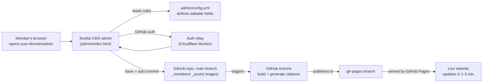

# Lab Website - Visual Admin (Sveltia CMS) Guide & Operations

This guide pairs with two files: `admin/index.html` and `admin/config.yml`.
After reading it you'll understand: **how the whole thing fits together, how lab members use it, how to move it to the lab account, and how to bind your domain.**

---

## 1. How it all connects



In one line: **fill out a form in the admin -> auto-commit to GitHub -> Actions rebuilds -> site updates.** Members only ever see forms; they never touch code and can't break layout (layout is locked by the template; the admin only exposes content fields).

What each file does:
| File | Role |
|---|---|
| `admin/index.html` | The admin entry page; loads the Sveltia CMS app |
| `admin/config.yml` | **Core**: defines which collections exist and which fields each one can edit |
| `_members/*.md` | One file per member (the admin's "Members" collection reads/writes here) |
| `_posts/*.md` | One file per news post (the admin's "News" collection reads/writes here) |
| `images/` | All images (admin uploads land here) |

---

## 2. Daily use for members (zero coding)

> Prerequisite: the member has a GitHub account and the admin added them as a collaborator on the repo (see section 4).

1. Open `https://your-domain/admin` in a browser (during practice: `https://username.github.io/repo/admin`).
2. First time: click **Login with GitHub** and authorize once (auto-login afterward).
3. Pick a collection on the left: **Members / News**.
4. Edit a person: open a member -> change name/role/upload photo/write bio -> **Save** (top right).
   - Add: click **+ Members** to create a new one. Remove: open the member -> delete the entry.
5. Post news: **+ News** -> fill title/date/author(dropdown)/body -> Save.
6. Live in ~1-3 min after saving. Don't see the change? **Ctrl+F5** (Mac: Cmd+Shift+R) to bypass cache.

**Did it work?** A green check on that build in the repo's **Actions** tab = success; a red X = failure (usually an oversized image or a bad field) - click in to read the error.

---

## 3. One-time auth setup (admin does it once, everyone benefits)

GitHub Pages is a pure static site, so logging in to GitHub needs an "auth relay." Use a free Cloudflare Worker, ~10 minutes:

**A. Create a GitHub OAuth App**
1. GitHub avatar -> **Settings -> Developer settings -> OAuth Apps -> New OAuth App**.
2. Fill in:
   - Application name: `Lab Website CMS` (any name)
   - Homepage URL: `https://username.github.io/repo/` (swap for the lab domain later)
   - **Authorization callback URL**: `https://your-worker.workers.dev/callback` (fill in after the Worker exists)
3. After creating, note the **Client ID** and generate a **Client Secret**.

**B. Deploy the auth Worker (sveltia-cms-auth)**
1. Sign up for a free Cloudflare account -> Workers.
2. Deploy the official `sveltia-cms-auth` (repo: github.com/sveltia/sveltia-cms-auth; README has one-click deploy steps).
3. In the Worker's environment variables, add the **Client ID / Client Secret** from step A plus the allowed origin domains.
4. Get the Worker URL, e.g. `https://lab-cms-auth.xxx.workers.dev`, and put it back into step A's callback URL.

**C. Write the URL into the CMS config**
Open `admin/config.yml`, uncomment the `base_url` line and set the Worker URL:
```yaml
backend:
  name: github
  repo: username/repo
  branch: main
  base_url: https://lab-cms-auth.xxx.workers.dev
```
After committing, **Login with GitHub** at `/admin` will work.

> Don't want to set up a Worker yet? You can sign in with a **Personal Access Token** instead: at `/admin` choose **Sign in with Token** and paste a fine-grained PAT (Repository access = your site repo, Permissions -> Contents: Read and write). Good for solo testing; deploy the Worker before handing the admin to other members.

---

## 4. Permissions: how the admin adds people / controls who can edit

Who can use the admin = who is a collaborator on this GitHub repo.
1. Repo **Settings -> Collaborators (and teams) -> Add people**, enter the member's GitHub username to invite.
2. Grant **Write** (can commit content, can't change repo settings/delete the repo).
3. Once they accept, they can log in at `/admin` and edit. Revoke editing = remove them from Collaborators.

After moving to the lab **Organization**, prefer **Teams**: add members to a Team, give that Team Write access to the repo - easier bulk management.

---

## 5. Moving to the lab GitHub account later

When content is ready and you want to go live:

1. **Transfer the repo**: repo **Settings -> bottom Danger Zone -> Transfer ownership**, target = the lab org.
   - Content, history, and Actions are all preserved. The template's `update-url.yaml` **auto-updates the site URL**.
2. **Update two pointers** (required after transfer):
   - `repo:` in `admin/config.yml` -> `lab-org/repo`.
   - The OAuth App's **Homepage / callback URL** and the Cloudflare Worker's allowed origins -> new domain.
3. **Re-set Pages**: in the new repo confirm **Settings -> Pages -> Deploy from a branch -> gh-pages -> /root** again.
4. Re-invite members as collaborators on the new repo (or use an org Team, see section 4).

---

## 6. Binding your existing lab domain

Say your domain is `lab.university.edu` (subdomain) or `yourlab.org` (apex):

1. **GitHub side**: repo **Settings -> Pages -> Custom domain**, enter the domain -> Save.
   (This auto-creates a `CNAME` file in the repo - don't delete it.)
2. **DNS side** (in your domain registrar / ask dept IT to add records):
   - **Subdomain** (e.g. `lab.university.edu`): add a **CNAME** record pointing to `lab-org.github.io`.
   - **Apex domain** (e.g. `yourlab.org`): add GitHub's 4 **A records**
     `185.199.108.153 / 185.199.109.153 / 185.199.110.153 / 185.199.111.153`
     (optionally add a `www` CNAME pointing to `lab-org.github.io`).
3. After DNS propagates (minutes to hours), go back to GitHub Pages and tick **Enforce HTTPS**.
4. **Sync the rest**:
   - `url` in `_config.yaml` (`update-url.yaml` usually handles this automatically - just confirm).
   - OAuth App Homepage/callback and Worker allowed origins -> new domain.

Then `https://your-domain/` is the site and `https://your-domain/admin` is the admin.

---

## 7. Things NOT in the admin, but occasionally edited (admin, one line each)

These are intentionally kept out of the admin (they contain layout or are low-frequency). Edit by hand as needed:

| What to change | How |
|---|---|
| **Logo** | Add `images/logo.svg` (or `.png` / `.jpg`). |
| **Font size / fonts / colors** | Edit `_styles/-theme.scss` (`:root { ... }`). |
| **Page headings + icons** (e.g. the "Research" / "Team" titles) and **nav order/tooltips** | Edit each page's `index.md` frontmatter and its first heading line. WARNING: page bodies contain `` layout components - **only edit text, never delete lines with ``.** |
| **Jekyll / plugin settings** | `_config.yaml`. |

> Now editable in the admin (previously hand-edited): **Publications** (Publications section), **lab name / subtitle / social links** (Site settings), and **all page intro text + panels** (Pages). See `Editing-Reference.md`.

---

## 8. Install checklist

- [ ] Repo created, Pages serving from `gh-pages` branch, home page loads
- [ ] `admin/index.html` and `admin/config.yml` added to the repo
- [ ] `repo:` in `config.yml` set to your "username/repo"
- [ ] GitHub OAuth App + Cloudflare auth Worker created, `base_url` filled in
- [ ] `/admin` logs in via GitHub, can edit members/news and save successfully
- [ ] (Later) after transfer to lab account + domain binding, sync `repo:` / OAuth / Worker / DNS
